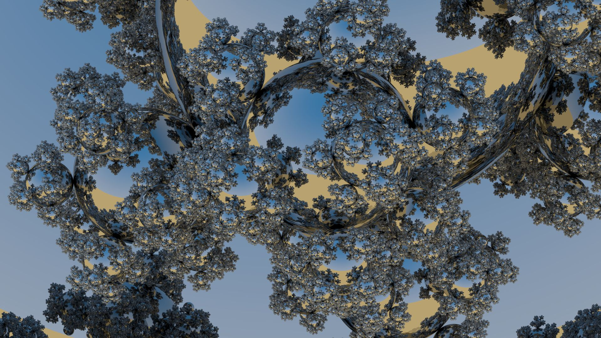

Getting Started with RTX Ray Tracing
========================================

This directory contains Chris Wyman's shader tutorials from the SIGGRAPH 2018 Course 
"Introduction to DirectX Raytracing" along with an additional "sphereflake" demo.
Visit the [course webpage](http://intro-to-dxr.cwyman.org)
to get more details, more descriptive
code walkthroughs, some prebuilt tutorial binaries, course presentations, and other information 
about the course.

Please read this document carefully before trying to build our tutorials. Given DirectX 
Raytracing is not fully finalized and stabilized, building code that relies on it is still
somewhat complex and can fail in surprising ways. We have tried to specify all requirements
and caveats, to avoid pain in getting started, and we will update this tutorial code as 
requirements change. Please contact us or [log an issue](https://github.com/NVIDIAGameWorks/GettingStartedWithRTXRayTracing/issues) if you run into unexpected troubles not covered below.

Also note: None of the tutorial examples are intended to demonstrate best practices for
highly optimized performance. These samples are optimized to provide an easy starting point, 
clarity, and general code readability (rather than performance).

Source code for our tutorials and shaders is licensed under a [**BSD license**](LICENSE.MD).  Models, textures, 
and other resources have their own licenses (see 'Acknowledgments' below).

Software/Hardware Requirements:
-------------------------------

0. This code.
   * If you clone this repository using a command window, please use the standard Windows CMD window, not a Linux shell, which can alter the CR/LF in project files and make them fail with errors such as "c1xx : fatal error C1083: Cannot open source file: '..\SharedUtils\FullscreenLaunch.cpp': No such file or directory" and similar when building the code.
1. Windows 10 RS4.
   * If you run "winver.exe" you will need the older **Version 1803** (OS Build 17134).
   * The tutorials do *not* yet run on versions of Win 10 RS5, e.g., the current version 1809. We hope to update soon.
   * Later releases will run on Win 10 RS5, once I have time to rebuild and test them there.
2. For now, Windows needs to be in "Developer Mode."
   * Go to "PC Settings" -> "Updates & Security" -> "For developers".
   * Toggle to "Developer Mode"
3. Microsoft Visual Studio 2017.
   * The free [Community Edition](https://visualstudio.microsoft.com/downloads/) works fine.
4. Windows 10 SDK 10.0.16299.91.
   * [Download SDK](https://developer.microsoft.com/en-us/windows/downloads/sdk-archive)
   * Note: Later SDK versions *probably* work, but you would need to change each Visual Studio project
     to look for the SDK you download, rather than 10.0.16299.91.  (Do this
     under Project -> Properties -> Config Properties -> General -> Window SDK Version)
5. A graphics card supporting DirectX Raytracing.
   * Currently, limited to newer NVIDIA cards, e.g., [Titan V](https://www.nvidia.com/en-us/titan/titan-v/) and [Turing-class cards](https://www.nvidia.com/en-us/geforce/turing/).
   * Eventually, the tutorials should work via the software fallback.  They don't yet.
     I expect after moving to Windows 10 RS5, the software fallback will be easier to link
     to simultaneously with vendor-supported DXR drivers.
6. An NVIDIA driver that natively supports DirectX Raytracing.
   * Includes public drivers after version 396, though we recommend version 400 or later.
   * When we can build and test on the software fallback layer, we will provide some guidance 
     on required drivers for other hardware.
7. The Release versions will compile and link with the files in this distribution. To link the Debug versions:
   * Download http://www.realtimerendering.com/downloads/nvidia/Falcor.lib and put it in the directory GettingStartedWithRTXRayTracing\Falcor\Framework\Lib\debugdxr.

Getting started:
----------------

Satisfying the requirements above, you're ready to get started.  

You should be able to unzip the tutorials directory almost anywhere. However, we have run into 
problems with the build scripts if the install directory contains spaces. For now, we suggest 
avoiding that.

Before compiling, _you need to download the other Falcor dependencies_. We suggest you do this by
running **update_dependencies.bat** in the **Falcor/** directory. It should download a bunch of
packages and put them in **Falcor/Framework/Externals/** and **Falcor/Media/**. The Visual Studio
solution will call this script for you via a pre-build step, but it sometimes gives confusing error 
messages when starting a parallel build.  This is not a problem if you run the script manually.

Open the Visual Studio solution **GettingStartedWithRTXRayTracing.sln**. We suggest you initially choose
the "Release" configuration to begin, as programs will start up and run faster. Then "Build | Build Solution"
to build all the tutorial programs. In the Solution Explorer you right-click and choose "Set as StartUp
Project" to run that tutorial.

Most tutorials load a default scene (the "modern living room" from Benedikt Bitterli's page).
We also include one other simple scene in directory **Falcor/Media/Arcade/**.  Additional, more complex 
scenes can be downloaded from the [Open Research Content Archive](https://developer.nvidia.com/orca):
 
   * [Amazon Lumberyard Bistro](https://developer.nvidia.com/orca/amazon-lumberyard-bistro)
   * [NVIDIA Emerald Square City Scene](https://developer.nvidia.com/orca/nvidia-emerald-square)
   * [UE4 Sun Temple](https://developer.nvidia.com/ue4-sun-temple)

Troubleshooting:
----------------

Visual Studio gives "Error MSB3073" when building.  This is an issue with the pre-build 
step, and we've seen it in the following cases:

   * The installation directory name (or parent directories) contains a space.
   * You ran a parallel build; our pre-build script gets called for each tutorial and fails 
     on all except the first.  This is usually a one-time error and rebuilding solves the problem.
   * There are installation problems with the dependencies.  Remove the "Falcor/Media/" directory
     and all subdirectories in the **Falcor/Framework/Externals/** directory (you can do this with
	 **delete_dependencies.bat**) and rerun **update_dependencies.bat** in the **Falcor/**
	 directory.

Visual Studio gives "c1xx : fatal error C1083: Cannot open source file: '..\SharedUtils\FullscreenLaunch.cpp': No such file or directory" or similar when building.  As noted in step 0, cloning the repository with Git under certain shells such as Ubuntu can cause problems with end of line characters and so alter project files. Use the Windows CMD command prompt, or if all else fails, download the zip.

Tutorial Information:
---------------------

Note the UI has a number of slightly-hidden features. Hover your mouse over the "(?)" next to "Keyboard
Shortcuts" at the top of the menu on the left to see some useful key shortcuts. "Global Controls" can be
viewed by clicking on the small arrow to the left of this text.

The mouse orbits and WASD moves the camera through the scene, along with Q and E for
down and up. Camera movement can be made slower by holding down "Ctrl" and faster by holding down "Shift."

Each tutorial demonstrates how to implement some basic rendering algorithm. Much of the focus of each is
the set of shaders in the **Shaders** directory. You are encouraged to modify these shaders and the rest of
the code as you wish. One nice feature of the [Falcor framework](https://github.com/NVIDIAGameWorks/Falcor)
is that you can modify and reload the shaders without restarting the program. While focused on the program,
press F5 and then change the view or toggle some feature that causes a refresh. The new shaders should then
take effect.

For the two standalone demos, "Ray Tracing In One Weekend" and "Sphereflake," you may wish to modify the
code named after the demos, in the **Passes** directory of each. For example, **SphereflakeDemoPass.h** lets
you change how many spheres are generated (we start at 7 for mSizeFactor, but 8 can work on many systems)
and whether the spheres are shiny or diffuse.

Additional Resources for DirectX Raytracing:
--------------------------------------------

Chris has [a code walkthrough](http://cwyman.org/code/dxrTutors/dxr_tutors.md.html) for his shader tutorials. You can download most of the [prebuilt binaries](http://intro-to-dxr.cwyman.org/tutorsRS4Binary-README.txt) (please [read the readme](http://intro-to-dxr.cwyman.org/tutorsRS4Code-README.txt) to avoid issues; also, does not include the Sphereflake demo).

Other useful resources:

   * The DirectX Raytracing (DXR) [specification v0.09](http://intro-to-dxr.cwyman.org/spec/DXR_FunctionalSpec_v0.09.docx).
   * Microsoft's experimental [installation package](http://forums.directxtech.com/index.php?topic=5860.0) with everything needed to build DXR apps.
   * Microsoft's [early DXR samples](https://github.com/Microsoft/DirectX-Graphics-Samples/tree/master/Samples/Desktop/D3D12Raytracing).
   * NVIDIA's [early DXR samples](https://github.com/NVIDIAGameWorks/DxrTutorials).
   * NVIDIA Research's [Falcor prototyping framework](https://developer.nvidia.com/falcor).
   * The [_Real-Time Rendering_ Ray Tracing Resources Page](http://www.realtimerendering.com/raytracing.html), which includes a free chapter on the basic ideas behind DXR and interactive ray tracing.

----------------------------------------------------------------------------------------------
Acknowledgments:
----------------------------------------------------------------------------------------------

The desert HDR environment map (MonValley Dirtroad) is provided from the sIBL Archive under a 
Creative Commons license [CC BY-NC-SA 3.0 US](http://www.hdrlabs.com/sibl/archive.html).

The included "pink_room" scene is named 'The Modern Living Room' by Wig42 on [Benedikt Bitterli's
webpage](https://benedikt-bitterli.me/resources/). It has been modified to match the Falcor 
material system.  This scene was released under a CC-BY license. It may be copied, modified and 
used commercially without permission, as long as: Appropriate credit is given to the original author
The original scene file may be obtained [here](http://www.blendswap.com/blends/view/75692).

The moon texture came from here under [CC BY 4.0 license](https://www.solarsystemscope.com/textures/).

The earth texture is [public domain from here](http://www.shadedrelief.com/natural3/pages/textures.html).

The normal map texture is licensed [CC0 from here](https://texturehaven.com/textures/).